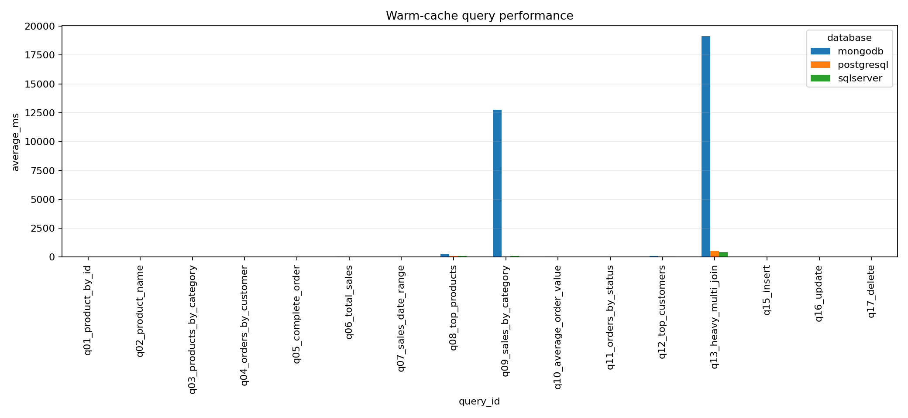
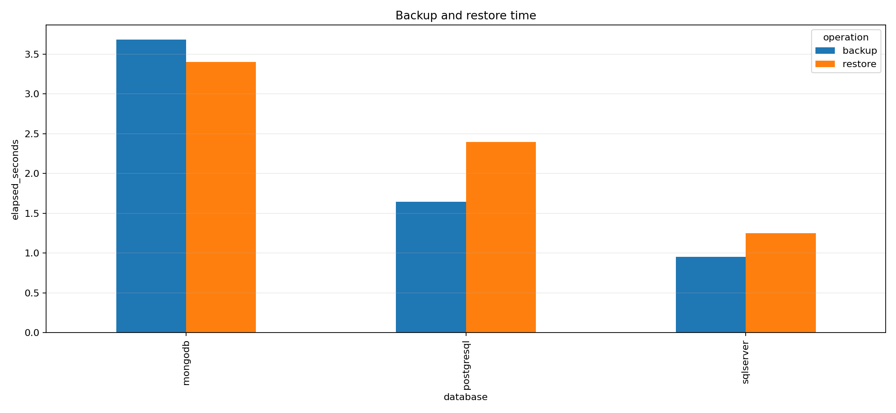

# گزارش نهایی پروژه

## 1. هدف پروژه

سه پایگاه دادهٔ زیر برای یک فروشگاه آنلاین یکسان پیاده‌سازی و مقایسه شدند:

- SQL Server 2022
- PostgreSQL 16.4
- MongoDB 7.0.14

معیارهای مقایسه:

- زمان درج داده
- زمان اجرای Query
- CPU و RAM
- فضای ذخیره‌سازی
- Backup و Restore
- اثر Index
- تفاوت مدل رابطه‌ای و Document-oriented
- امنیت و سختی توسعه

## 2. طراحی داده

هشت موجودیت استفاده شد:

`Customers`, `Categories`, `Products`, `Orders`, `OrderItems`, `Payments`, `Addresses`, `Shipment`

در SQL Server و PostgreSQL، مدل کاملاً رابطه‌ای با Primary Key، Foreign Key، Unique، Check و روابط 1:N و 1:1 ساخته شد.

در MongoDB:

- Address داخل Customer قرار گرفت.
- OrderItems، Payment، Shipment و Snapshot آدرس داخل Order قرار گرفتند.
- Product و Category به‌صورت Reference باقی ماندند.
- برای MongoDB از Foreign Key استفاده نشد؛ اعتبار ارتباطات توسط Generator و Loader کنترل شد.

## 3. Dataset

دادهٔ مشترک و قابل بازتولید تولید شد:

| نوع داده | تعداد |
|---|---:|
| Customers | 20,000 |
| Addresses | 20,000 |
| Categories | 50 |
| Products | 10,000 |
| Orders | 100,000 |
| OrderItems | 299,053 |
| Payments | 100,000 |
| Shipment | 100,000 |

ویژگی‌ها:

- Seed ثابت: `20260830`
- تاریخ‌ها، قیمت‌ها و وضعیت‌ها یکسان
- داده‌ها با Python تولید شدند.
- Batch Insert استفاده شد.
- داده‌ها مصنوعی ولی منطقی و realistic هستند.

## 4. Queryها

۱۶ عملیات مستقل با ۱۰ تکرار اجرا شد:

- جستجوی Product بر اساس ID
- جستجوی Product بر اساس نام
- Productهای یک Category
- سفارش‌های یک Customer
- جزئیات کامل Order
- Total Sales
- Sales در بازهٔ زمانی
- Top Selling Products
- Sales بر اساس Category
- Average Order Value
- تعداد سفارش‌ها بر اساس Status
- Customerهای پردرآمد
- Heavy Multi-Join / equivalent MongoDB Aggregation
- Insert
- Update
- Delete

در مجموع:

```text
3 Database × 2 Index Phase × 16 Query × 10 Repetition = 960 raw measurements
```

## 5. روش اجرا

Benchmark در دو حالت انجام شد:

1. بدون Indexهای اضافی
2. با Indexهای پیشنهادی

برای هر Query:

- یک Warm-up بدون زمان‌گیری
- سپس ۱۰ اجرای واقعی
- اندازه‌گیری با `time.perf_counter()`
- محاسبهٔ Average، Minimum، Maximum، Median و Standard Deviation

Docker روی Host با ۴GB RAM اجرا شد و سرویس‌ها به‌صورت ترتیبی اجرا شدند تا منابع بین دیتابیس‌ها تداخل ایجاد نکند.

## 6. نتایج اصلی

### Insert

| Database | زمان درج |
|---|---:|
| MongoDB | 11.423 ثانیه |
| SQL Server | 27.139 ثانیه |
| PostgreSQL | 27.587 ثانیه |

MongoDB در درج داده سریع‌تر بود؛ چون یک Order به‌صورت یک Document ذخیره می‌شود و نیاز به Insert جداگانهٔ چندین جدول ندارد.

### میانگین Query در حالت Indexed

| Database | Average Query |
|---|---:|
| SQL Server | 39.291 ms |
| PostgreSQL | 46.922 ms |
| MongoDB | 2046.804 ms |

در میانگین کلی Queryها، SQL Server سریع‌ترین بود.



### اثر Index

| Database | بدون Index اضافی | با Index | تغییر |
|---|---:|---:|---:|
| SQL Server | 54.126 ms | 39.291 ms | حدود 27٪ بهتر |
| PostgreSQL | 48.368 ms | 46.922 ms | حدود 3٪ بهتر |
| MongoDB | 2011.499 ms | 2046.804 ms | تغییر معنادار مثبت مشاهده نشد |

در MongoDB، هزینهٔ اصلی مربوط به Aggregationهای سنگین و `$lookup/$unwind/$group` بود؛ بنابراین Indexها نتوانستند هزینهٔ اصلی آن Queryها را حذف کنند.

### Queryهای مهم

| Query | بهترین نتیجه |
|---|---|
| Product by ID | PostgreSQL |
| Product by Name | PostgreSQL |
| Products by Category | PostgreSQL |
| Orders by Customer | PostgreSQL |
| Complete Order | MongoDB |
| Total Sales | PostgreSQL |
| Sales by Date Range | PostgreSQL |
| Top Products | PostgreSQL |
| Sales by Category | PostgreSQL |
| Average Order Value | PostgreSQL |
| Orders by Status | PostgreSQL |
| Top Customers | PostgreSQL |
| Heavy Multi-Join | SQL Server |
| Insert | MongoDB |
| Update | MongoDB |
| Delete | PostgreSQL |

نکتهٔ مهم: MongoDB در Query جزئیات کامل Order سریع بود، چون اقلام، پرداخت و ارسال داخل همان Document قرار داشتند. اما در Queryهای تحلیلی سنگین عملکرد آن به‌شدت ضعیف‌تر شد.

## 7. منابع و Storage

| Database | Data/Index/Total |
|---|---:|
| SQL Server | 336 MiB |
| PostgreSQL | 122.153 MiB |
| MongoDB | 37.973 MiB |

MongoDB کمترین فضای گزارش‌شده را مصرف کرد، ولی این اعداد کاملاً هم‌معنا نیستند:

- SQL Server حجم فایل‌های Database را گزارش می‌کند.
- PostgreSQL اندازهٔ Database را گزارش می‌کند.
- MongoDB از `dbStats` استفاده می‌کند.

بنابراین Storage برای مقایسهٔ روند کلی مفید است، اما مقایسهٔ دقیق فیزیکی نیازمند تعریف یکسان Allocation، WAL، Log و Compression است.

## 8. Backup و Restore

| عملیات | SQL Server | PostgreSQL | MongoDB |
|---|---:|---:|---:|
| Backup | 0.953 s | 1.644 s | 3.683 s |
| Restore | 1.251 s | 2.395 s | 3.405 s |

SQL Server در Backup و Restore سریع‌ترین بود.



Restore دیتابیس‌های SQL Server و PostgreSQL با شمارش رکوردها تأیید شد:

- 20,000 Customer
- 20,000 Address
- 50 Category
- 10,000 Product
- 100,000 Order
- 299,053 OrderItem
- 100,000 Payment
- 100,000 Shipment

MongoDB نیز 130,050 Document سطح Collection را بدون خطا Restore کرد. علاوه بر آن، 20,000 آدرس embedded و شمارش منطقی OrderItems، Payment و Shipment نیز تأیید شدند.

## 9. CPU و RAM

در فاز Indexed:

| معیار | SQL Server | PostgreSQL | MongoDB |
|---|---:|---:|---:|
| Average CPU | 3.557٪ | 2.795٪ | 5.850٪ |
| Peak Host RAM | 3933 MiB | 3670 MiB | 3337 MiB |

این اعداد مصرف کل Host را نشان می‌دهند، نه فقط Process داخلی دیتابیس.

## 10. امنیت

### SQL Server

مزایا:

- Authentication قوی
- Role-Based Access Control
- TLS
- TDE
- Backup Encryption
- Auditing
- Row-Level Security
- Column permissions و Always Encrypted

معایب:

- پیچیدگی مدیریتی بیشتر
- هزینهٔ License در محیط Production
- تفاوت قابلیت‌ها بین Editionها

### PostgreSQL

مزایا:

- متن‌باز و رایگان
- Role و Privilege قدرتمند
- TLS
- SCRAM، LDAP، Certificate و Kerberos
- Row-Level Security
- Logging قوی
- انعطاف‌پذیری بالا

معایب:

- TDE داخلی عمومی ندارد.
- Auditing پیشرفته معمولاً به Extension مانند pgAudit نیاز دارد.
- بعضی سیاست‌های امنیتی باید توسط Administrator طراحی شوند.

### MongoDB

مزایا:

- Authentication و RBAC
- TLS
- SCRAM و X.509
- Client-Side Field Level Encryption
- Schema Validation

محدودیت‌ها:

- Foreign Key ندارد.
- Row-Level Security معادل مستقیم SQL ندارد.
- Encryption at Rest و Auditing کامل در Self-managed عمدتاً Enterprise است.
- MongoDB Community را نباید با قابلیت‌های Enterprise مقایسهٔ مستقیم کرد.

## 11. سختی توسعه

در پروژه برای Developer Effort یک Rubric پنج‌امتیازی طراحی شد که معیارهای زیر را شامل می‌شود:

- Setup
- Schema
- Query
- مدیریت Relation
- Migration
- Index Management
- Backup/Restore
- Debugging و Observability

امتیاز قطعی عددی اعلام نشد، چون بدون ثبت زمان توسعه و مشکلات واقعی، امتیازدهی سلیقه‌ای می‌شود.

ارزیابی کیفی:

- PostgreSQL: تعادل خوب و پیچیدگی متوسط
- SQL Server: امکانات زیاد، ولی Setup و مدیریت پیچیده‌تر
- MongoDB: شروع سریع و Schema انعطاف‌پذیر، اما Integrity و Queryهای رابطه‌ای دشوارتر

## 12. محدودیت‌های آزمایش

- Host از معماری ARM64 استفاده می‌کرد.
- SQL Server با `linux/amd64 emulation` اجرا شد.
- Docker فقط ۴GB RAM داشت.
- فقط Warm Cache آزمایش شد.
- Dataset مصنوعی بود.
- MongoDB مدل Document داشت و SQLها مدل Normalized داشتند.
- Query سنگین MongoDB از نظر فیزیکی معادل JOIN SQL نیست.
- Storage metricها در سه موتور دقیقاً یکسان تعریف نشده‌اند.
- آزمایش روی یک Host و Single-node انجام شد.
- نتیجه برای تمام Workloadهای واقعی قابل تعمیم نیست.

## 13. نتیجهٔ نهایی

### اگر فقط سرعت Query و Backup مهم باشد

SQL Server بهترین نتیجهٔ این آزمایش را داشت.

### اگر یک سیستم متن‌باز، متعادل و مناسب فروشگاه آنلاین بخواهیم

PostgreSQL انتخاب پیشنهادی است، چون:

- Queryهای تحلیلی بسیار خوب داشت.
- Storage کمتری از SQL Server مصرف کرد.
- CPU کمتری مصرف کرد.
- روابط و Integrity را مستقیماً enforce می‌کند.
- رایگان و متن‌باز است.
- برای E-commerce و سیستم‌های تراکنشی مناسب است.

### اگر Insert سریع و Document انعطاف‌پذیر مهم باشد

MongoDB مناسب‌تر است، مخصوصاً برای:

- Catalogهای انعطاف‌پذیر
- Event و Log
- سیستم‌های Document-oriented
- داده‌هایی که معمولاً به‌صورت کامل و یکجا خوانده می‌شوند
- Workloadهایی که JOIN و گزارش‌های رابطه‌ای سنگین ندارند

## انتخاب پیشنهادی نهایی

برای همین سناریوی فروشگاه آنلاین:

> PostgreSQL بهترین انتخاب کلی و متعادل است.

اما:

- SQL Server برای سازمان‌های Microsoft و محیط‌های Enterprise انتخاب قوی‌تری است.
- MongoDB زمانی بهتر است که مدل داده واقعاً Document-oriented باشد، نه اینکه صرفاً جداول رابطه‌ای را به Document تبدیل کنیم.

فایل‌های کامل پروژه همراه این گزارش در فایل ZIP تحویل داده شده‌اند.
